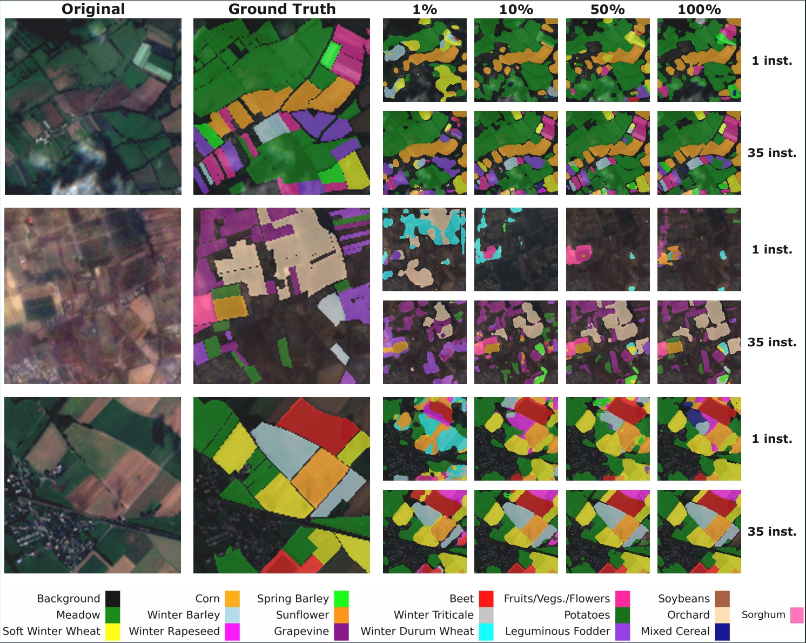

# Shaping Fine-Tuning of Geospatial Foundation Models: Effects of Label Availability and Temporal Resolution

🔥 The [pre-print](https://arxiv.org/) is out!

## 📚 Introduction

Fine-tuning foundation models is a key step in adapting them to a particular task. In the case of Geospatial Foundation Models (GFMs), fine-tuning can be particularly challenging given data scarcity both in terms of the amount of labeled data and, in the case of Satellite Image Time Series (SITS), temporal context. Under these circumstances, the optimal GFM fine-tuning strategy across different labeled data regimes remains poorly understood. In this paper, we thoroughly assess and study the performances of two different GFMs given several combinations of two data scarcity factors: number of labeled samples and sequence length. Specifically, we analyze the performances on a crop classification task, i.e., semantic segmentation, of the Sentinel-2 images contained in the PASTIS-HD dataset. We compare GFMs to U-TAE, a fully supervised baseline, across varying amounts of labeled data (1%, 10%, 50%, 100%) and temporal input lengths (1, 6, 15, 25 and 35) under different training configurations.





In this repo, you can find the code to our work. We included two GFMs that present different approaches.

For the moment, we support the following **models**:

|             | Paper | GitHub | Keywords |
|:-----------:|:-----:|:------:|:--------:|
|  [SSL4EOS12](https://arxiv.org/abs/2211.07044)  | SSL4EO-S12: A Large-Scale Multi-Modal, Multi-Temporal <br> Dataset for Self-Supervised Learning in Earth Observation      | [link](https://github.com/zhu-xlab/SSL4EO-S12) | DINO|
|  [CROMA](https://arxiv.org/pdf/2311.00566)      | CROMA: Remote Sensing Representations with Contrastive Radar-Optical Masked Autoencoders  | [link](https://github.com/antofuller/CROMA) | Contrastive Learning, MAE |
|  [U-TAE](https://arxiv.org/abs/2107.07933) | Panoptic Segmentation of Satellite Image Time Series with Convolutional Temporal Attention Networks    | [link](https://github.com/VSainteuf/utae-paps) | U-Net + Time-Attention Encoding |

And the following **datasets**:

|                     | Download | Domain | Task | Sensors | Location |
|:-------------------:|:--------:|:------:|:----:|:-------:|:--------:|
|        [PASTIS-R](https://arxiv.org/abs/2404.08351)       |    [link](https://huggingface.co/datasets/IGNF/PASTIS-HD)       |   Agriculture     |  Semantic Segmentation    |    S1, S2, SPOT-6  | France   |

The repository supports Multi-Temporal Semantic Segmentation using geospatial foundation models.

It is also possible to train a [supervised baseline](#-fully-supervised-baseline), based on UTAE.

## 🛠️ Setup
Clone the repository:
```
git clone https://github.com/GioCastiglioni/ShapingFT.git
cd ShapingFT
```

**Dependencies**

```
conda env create -n ShapingFT python=3.11
conda activate ShapingFT
cd ShapingFT
pip install -r requirements.txt
```

## 🏋️ Training

To run experiments, please refer to `configs/train.yaml`. In it, in addition to some basic info about training (e.g. `finetune` for fine-tuning also the encoder, `limited_label_train` to train the model on a subset of labels, `num_workers`, `batch_size` and so on), there are more basic configs:
- `preprocessing`: Both preprocessing and augmentations steps required for the dataset, such as bands adaptation, normalization, resize/crop.


Other 3 configs are used to set other training parameters:
- `criterion`: in which you can choose the loss for the training. Consider that if you want to add a custom loss, you should add to `shapeft/utils/losses.py`. We support `cross_entropy` and `weigthed_cross_entropy` loss functions.
- `lr_scheduler`: in which you can choose the scheduler. Consider that if you want to add a custom one, you should add to `shapeft/utils/schedulers.py`. 
- `optimizer`: in which you can choose the optimizer. Consider that if you want to add a custom one, you should add to `shapeft/utils/optimizers.py`.


We provide several examples of command lines to initialize different training tasks on single GPU.

Please note:
 - The repo adopts [hydra](https://github.com/facebookresearch/hydra), so you can easily log your experiments and overwrite parameters from the command line. More examples are provided later.
 - To use more gpus or nodes, set `--nnodes` and `--nproc_per_node` correspondingly. Please refer to the [torchrun doc](https://pytorch.org/docs/stable/elastic/run.html).

```
export PATH="$HOME/miniconda3/bin:$PATH"
source "$HOME/miniconda3/etc/profile.d/conda.sh"
conda activate ShapingFT
export PYTHONPATH=$HOME/ShapingFT:$PYTHONPATH
cd $HOME/ShapingFT
```

### 💻 Decoder Finetuning

```
torchrun --nnodes=1 --nproc_per_node=1 shapeft/run.py --config-name=train -m \
dataset=pastis \
dataset.multi_temporal=1,6,15,25,35 \
encoder=croma_optical \
decoder=seg_upernet_mt_ltae \
preprocessing=seg_default \
criterion=cross_entropy \
optimizer.lr=0.001 \
finetune=False \
from_scratch=False \
work_dir=$HOME/ShapingFT/results \
limited_label_train=0.01,0.1,0.5,1.0
```

### 💻 End-to-end Finetuning

It is enough to add `finetune=True` to the command line, and select the desired fine-tuning rate (lr_encoder/lr_decoder).

```
torchrun --nnodes=1 --nproc_per_node=1 shapeft/run.py --config-name=train -m \
dataset=pastis \
dataset.multi_temporal=1,6,15,25,35 \
encoder=croma_optical \
decoder=seg_upernet_mt_ltae \
preprocessing=seg_default \
criterion=cross_entropy \
optimizer.lr=0.001 \
ft_rate=0.1 \
finetune=True \
from_scratch=False \
work_dir=$HOME/ShapingFT/results \
limited_label_train=0.01,0.1,0.5,1.0
```

Note: You also have the option to train the GFM architecture from scratch, without loading its pretrained weights.

### 💻 Fully Supervised Baseline 

The repo supports also training a fully supervised UTAE. To run it, follow the same command line rules as for other models. Keep in mind that setting finetune=True and from_scracth=True is necessary since this fully supervised approach trains the model from scratch. 

```
torchrun --nnodes=1 --nproc_per_node=1 shapeft/run.py --config-name=train -m \
dataset=pastis \
dataset.multi_temporal=1,6,15,25,35 \
encoder=utae_encoder \
decoder=seg_utae \
preprocessing=seg_default \
criterion=cross_entropy \
optimizer.lr=0.001 \
ft_rate=1.0 \
finetune=True \
from_scratch=True \
work_dir=$HOME/ShapingFT/results \
limited_label_train=0.01,0.1,0.5,1.0
```

## 🏃 Evaluation 

An evaluation step is always run after the training.

If you want to just run an evaluation, indicate the `ckpt_dir` where the checkpoints and configurations are stored.

```
torchrun shapeft/run.py --config-name=test ckpt_dir=path_to_ckpt_dir
```
## 📝 Citation

If you find this work useful, please cite:

```
@misc{castiglioni2025shapingfinetuningofgfm,
      title={Shaping Fine-Tuning of Geospatial Foundation Models: Effects of Label Availability and Temporal Resolution}, 
      author={Giovanni Castiglioni and Nicolas Isla and Cristian Buc and Javiera Castillo-Navarro and Sebastien Lefèvre and Valentin Barriere},
      year={2025},
      archivePrefix={arXiv},
      primaryClass={cs.CV},
      url={https://arxiv.org/}, 
}
```

## 🙏 Acknowledgment

This repository builds upon the [PANGAEA Benchmark Repository](https://github.com/VMarsocci/pangaea-bench) by Marsocci, V. et al., incorporating substantial modifications. We gratefully acknowledge the foundational contributions of their work, which provided a solid starting point for our development.
